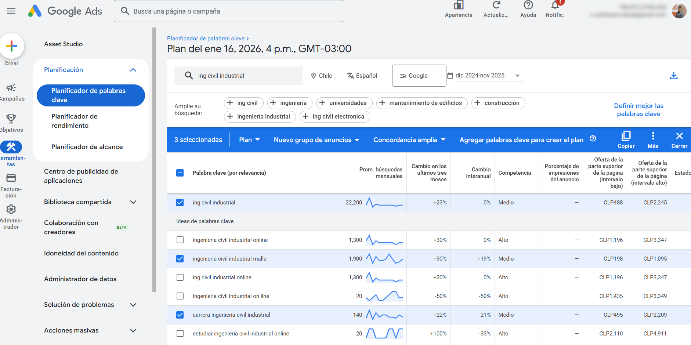
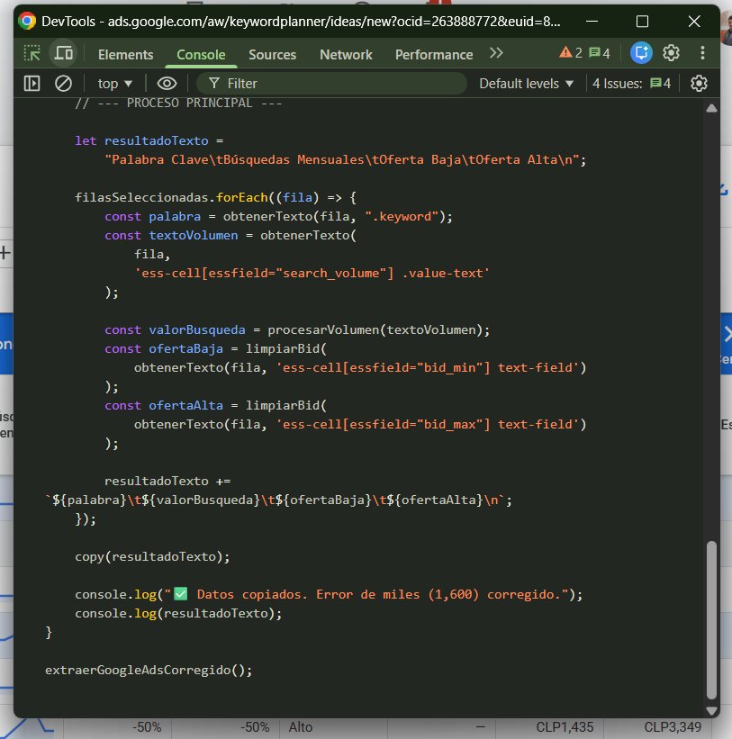

# Extracción de palabras seleccionadas en google Ads

Sacar palabras e información seleccionadas de google ads

El código se pega en la consola

## Historial de cambios

1. el código que está en el archivo 1 es el primer código entregado y logra extraer las palabras seleccionadas
2. el que está en el archivo 2, entrega las columnas que contienen valores monetarios como números y sin la moneda CLP
3. El archivo 3 copia automaticamente en formato tabla, antes lo dejaba en el portapapeles como json
4. Ahora en la columna de búsquedas el rango será entregado con un valor, dentro de ese rango
5. En la columna de Prom. búsquedas mensuales sí hay un valor exacto, entrega ese valor, sí hay un rango, entrega un valor dentro del rango
6. Había un error en que los número exactos por ejemplo 1,600 los extraía como 1, en vez de 1600; ahora se corrigió eso
